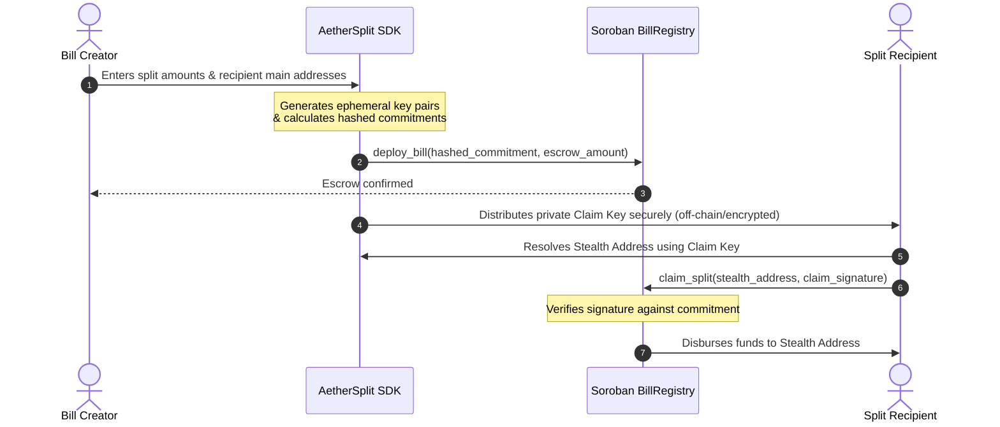
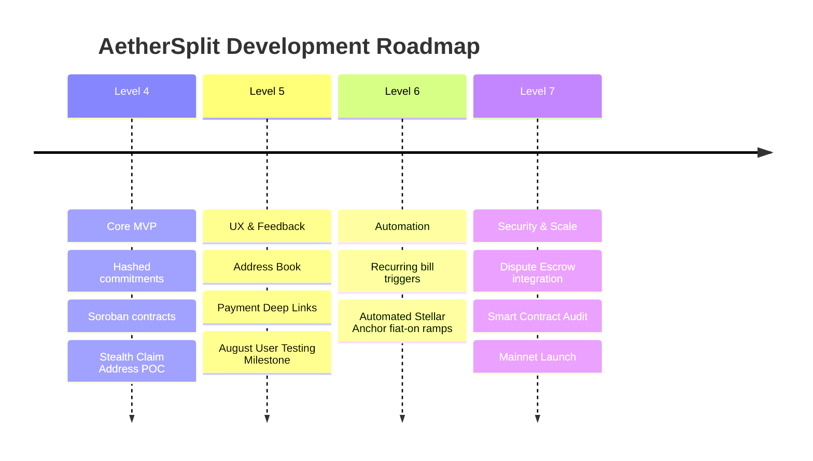

# AetherSplit — Pitch Deck
### Privacy-First Bill Splitting on Stellar
*Settle recurring liabilities and split expenses without exposing your financial history on-chain.*

---

## 📋 Table of Contents
1. **The Problem** — The lack of financial privacy in Web3 expense sharing.
2. **The Solution** — Privacy-preserving settlement via Soroban smart contracts.
3. **The Product** — Features, UI, and live demonstration.
4. **How It Works** — Technical architecture & stealth addresses.
5. **Market Opportunity** — Target audience & user persona.
6. **Traction & Validation** — Real user metrics and feedback.
7. **Business Model** — How AetherSplit sustains itself.
8. **Roadmap & Next Steps** — Levels 6-7 and future vision.

---

## 🔍 Slide 1: The Problem
### The Financial Surveillance of Public Ledgers

Every transaction on public blockchains is completely transparent. While this is great for accountability, it is highly detrimental for personal expense splitting and recurring bills.

* **On-Chain Linkability:** When roommates, colleagues, or friends repeatedly split bills (e.g., rent, subscriptions, dining) using standard wallets, their public keys become permanently linked.
* **Asset Exposure:** Any observer can inspect linked wallets to estimate participants' net worth, balance, and transaction history.
* **Privacy Leak:** Publicly showing recurring transaction frequencies reveals real-world relationships and personal habits.

> [!WARNING]
> **The Bottom Line:** Today's Web3 users are forced to choose between the efficiency of on-chain settlement and their right to financial privacy.

---

## 💡 Slide 2: The Solution
### AetherSplit — Privacy-First Expense Settlements

AetherSplit leverages the speed of the **Stellar Network** and the power of **Soroban Smart Contracts** to solve the linkability problem.

```
       [Public Expense Split Request]
                    │
                    ▼
     🔒 Hashed Commitments on Soroban
                    │
                    ▼
    👤 One-Time Stealth Claim Addresses
                    │
                    ▼
   [Private, Non-Custodial Disbursement]
```

* **Hashed Commitments:** Plain-text bill amounts and participant lists are cryptographically hashed and verified on-chain, keeping transaction metadata private.
* **One-Time Stealth Addresses:** For each recipient, a unique, randomized, single-use public key is generated. Senders deposit to this stealth address, breaking the link to the recipient's main wallet.
* **Non-Custodial Escrow:** Senders pay into a secure smart contract escrow which handles disbursements directly to the one-time addresses.

---

## 🎨 Slide 3: The Product
### Premium, Clean, Responsive Web App

AetherSplit is designed to feel fast, secure, and extremely premium.

* **Royal Emerald & Gold Interface:** A stunning dark mode visual style that makes finance feel secure, wealthy, and premium.
* **Built-in Address Book:** Effortlessly save and auto-calculate equal splits among recurring contacts.
* **One-Click Deep Links:** Direct Stellar URI integration simplifies paying one-time stealth addresses from standard wallets like Freighter.
* **Mobile-Responsive:** Optimized for on-the-go bill splits on smartphones and desktop browsers alike.

---

## ⚙️ Slide 4: Technical Architecture
### How AetherSplit Works Under the Hood

The diagram below outlines the flow of a private bill settlement:



* **No Observers Linked:** A third-party observer only sees deposits going into the `BillRegistry` and withdrawals going to random, unused addresses. They cannot link the withdrawal back to the `Recipient`'s main account.

---

## 📈 Slide 5: Market Opportunity
### Targeting the Privacy-Conscious Web3 Economy

The demand for on-chain privacy is growing rapidly as crypto goes mainstream.

* **Crypto-Native Freelancers & Agencies:** Businesses paying global contractors who want to keep operational expenses and compensation amounts confidential.
* **Web3 Cohousing & DAO Members:** Communities sharing resources, paying rent, and splitting daily expenses without revealing personal account balances to one another.
* **Privacy Advocates:** Individuals who believe their daily coffee splits or utility payments are not public data.

---

## 📊 Slide 6: Traction & Validation
### Real Growth & Active User Feedback

We expanded our reach to gather real data and validate product demand.

| Metric | Achievement |
| :--- | :--- |
| **Unique Active Users** | *[Pending August]* |
| **Total Bills Created** | *[Pending August]* |
| **Settlement Success Rate** | *[Pending August]* |
| **Average User Rating** | *[Pending August]* |

#### User-Driven Improvements:
* **Address Book Integration:** Added after beta testers reported that entering stealth recipient information manually was tedious.
* **Payment Deep Links:** Added to make it simple for non-technical users to pay stealth addresses directly from Freighter.

---

## 🪙 Slide 7: Business Model
### Sustainability & Future Monetization

AetherSplit is designed to be self-sustaining while remaining highly accessible.

* **Settlement Fee:** A nominal protocol fee (e.g., 0.1% of split value, capped at a maximum) on successful claims.
* **Premium Enterprise Features:** Advanced payroll, recurring batch settlement subscriptions, and accounting integrations for companies.
* **Integration SDK:** Allowing third-party wallets and dApps to embed AetherSplit's privacy engine for a licensing fee.

---

## 🗺️ Slide 8: Roadmap
### The Journey Ahead



---

## 🚀 Let's Build a Privacy-First Future
**AetherSplit** is bringing essential privacy tools to Stellar. Try it out today!

* **Live App:** [https://aether-split-level-4.vercel.app/](https://aether-split-level-4.vercel.app/)
* **Contract Address (BillRegistry):** `CCCBBGS27DSTKSCY4ERJXZBLZHVBPDYTBB3O3HDI73NUB5HXSSELZOQ7`
* **Contact:** info@aethersplit.io
