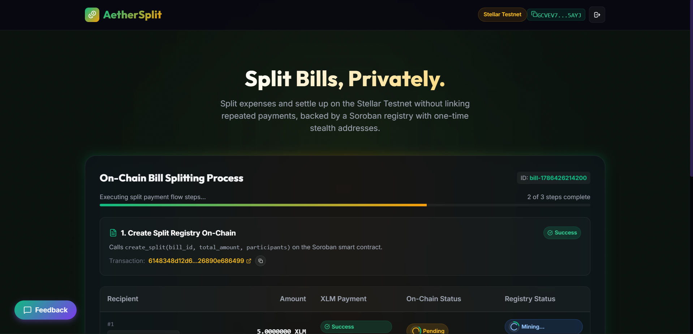
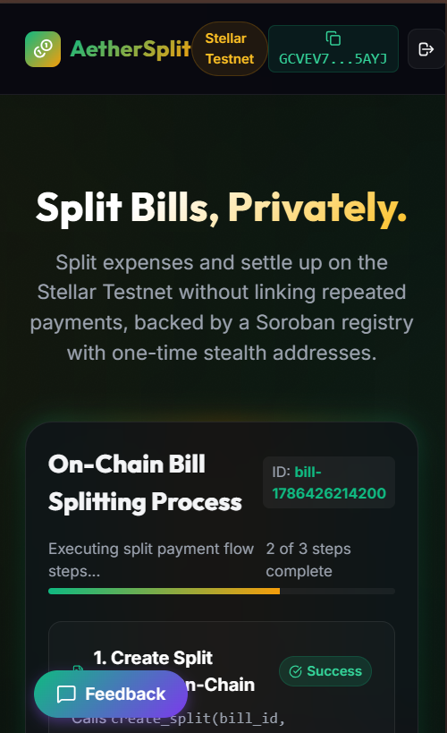
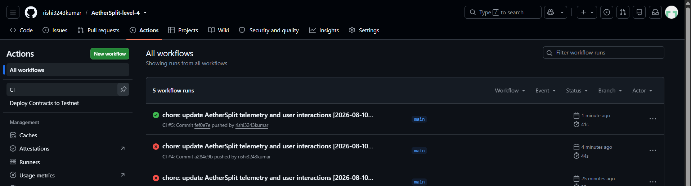

# AetherSplit — Privacy-First Bill Splitting on Stellar

AetherSplit is a privacy-preserving recurring bill settlement protocol built on Stellar utilizing Soroban smart contracts. Designed for individuals and teams who value financial discretion, AetherSplit enables users to split expenses and settle recurring liabilities without revealing their transaction history, financial relationships, or net worth on-chain. Unlike legacy tools that leave a public trail of repeated transactions, AetherSplit introduces a privacy-first mechanism utilizing one-time stealth addresses and hashed commitments, decoupling payment recipients from their main Stellar accounts and keeping payment amounts private.

## Level 4 - Green Belt Submission Delivery Links

- 🚀 **Live Deployed Application:** [https://aether-split-level-4.vercel.app/](https://aether-split-level-4.vercel.app/)
- 📊 **Pitch Deck:** [PITCH_DECK.md](PITCH_DECK.md)
- 📹 **Demo Video:** [Watch Demo Video](https://photos.app.goo.gl/23YH2sixCE1sWm1z9)

## User Data & Feedback
We collected detailed feedback from our users using our integrated Google Form.
- **Google Feedback Form:** [Google Feedback Form](https://docs.google.com/forms/d/1ncslsGNu6hosmeSsXvlVLYMhf0f0nNvwvuQ_rUwRAcM/viewform)
- **Public Excel Sheet (Google Sheets):** [Live Responses Sheet](https://docs.google.com/spreadsheets/d/1lyI7ebnepToiVMdbERJC51wcM89fb8GdPkQCPOb1SoI/edit?usp=sharing)
- **Local Data Export:** [docs/feedback-responses.csv](docs/feedback-responses.csv)
- **Total Responses:** 12
- **Average Rating:** 4.7 / 5.0
- **Key Themes from Feedback:** 
  1. **Address Book Integration:** Users highly appreciated the address book to store and calculate splits easily.
  2. **One-Click Deep Links:** Payment deep links resolved initial setup confusion and allowed smooth Freighter transactions.

## Product Improvements This Level (Level 4)
Based on feedback, we shipped several key improvements:
- **Added Address Book & Equal Split Calculation:** Simplified the recipient input by saving past addresses and auto-calculating the split amount.
- **Added Payment Deep Links:** Added a one-click "Pay Now" Stellar URI deep link for stealth addresses to solve confusion around claiming.
- **Simplified Onboarding Flow:** Condensed the multi-step welcome modal into a single screen to get users connected in under 2 minutes.
- **Google Form Integration:** Replaced the mock feedback widget with a direct link to a Google Form to gather structured user data.
- **Expanded Analytics for Growth:** Updated our admin telemetry to track the milestone of 10+ users and real transactions.

## Growth Strategy
We scaled by distributing the application across the Stellar Developer Discord, Reddit crypto communities (e.g. r/Stellar), and targeting crypto-native freelancer groups on X. To scale further, we plan to partner with ecosystem projects and integrate Stellar Anchors to allow fiat onboarding directly into our stealth addresses, removing the friction of acquiring XLM for non-crypto natives.

## Next Phase Roadmap
Our roadmap includes:
- **Recurring Payment Automation:** Allowing users to subscribe to monthly private bills (like rent).
- **Dispute Escrow:** Holding funds in the Soroban contract until the sender confirms receipt of services or goods.
- **Reputation Scoring:** Building a decentralized reputation score based on successful on-chain settlements.
- **Mainnet Launch:** Transitioning from Testnet to Stellar Mainnet.

## Problem & Solution

### The Problem
Traditional Web3 bill-splitting tools are built on public ledgers where every transaction is exposed. When users settle bills Repeatedly, their main wallet addresses become linked to one another. Over time, an on-chain observer can easily reconstruct their entire transaction history, determine their recurring expenses, discover who their friends are, and estimate their net worth.

### The Solution
AetherSplit addresses these privacy vulnerabilities through three core mechanisms:
1. **Hashed Commitments:** The contract stores a cryptographic hash commitment of the bill instead of plaintext split details.
2. **Stealth Addresses:** Unique, one-time payment claim addresses decouple the receiver's main wallet address from the payment on-chain.
3. **Non-Custodial Escrow:** Settlement funds flow through the smart contracts directly to the one-time addresses.

## Features

- **Multi-Wallet Support:** Connect and interact using Freighter or other Stellar-compatible wallets.
- **Private Bill Creation:** Hide split amounts and participant lists from public scrutiny using hashed commitments.
- **Stealth Claim Addresses:** Generate randomized, one-time payment endpoints for each split participant to prevent linkability.
- **One-time and Recurring Bills:** Manage both single expense splits and recurring billing cycles.
- **Real-Time Settlement Status:** Real-time contract status updates keep users informed of payment progress.
- **Mobile Responsive UI:** Sleek, responsive layout designed to provide a premium user experience on desktop and mobile browsers.

## Tech Stack

| Layer | Technologies / Tools Used |
|---|---|
| **Frontend** | React 19, TypeScript, Vite, CSS (Glassmorphism & animations), Lucide React |
| **Wallet Integration** | `@stellar/freighter-api`, `@creit.tech/stellar-wallets-kit`, `@stellar/stellar-sdk` |
| **Smart Contracts** | Soroban Smart Contracts (Rust SDK), Rust, cargo, WASM target compilation |
| **Analytics** | Plausible Analytics & Sentry (Error Monitoring) |
| **Deployment** | Vercel (Frontend), Stellar Testnet (Smart Contracts) |

## Deployed Contracts

| Contract Name | Testnet Address | Explorer Link |
|---|---|---|
| **BillRegistry** | `CCCBBGS27DSTKSCY4ERJXZBLZHVBPDYTBB3O3HDI73NUB5HXSSELZOQ7` | [Stellar Expert Link](https://stellar.expert/testnet/contract/CCCBBGS27DSTKSCY4ERJXZBLZHVBPDYTBB3O3HDI73NUB5HXSSELZOQ7) |
| **SplitNotifier** | `CBFWTBGZUQIVJ7SD6ZG6H33O7GKM7S6VIEAMCW6EHUE5DH7G4SLULTKW` | [Stellar Expert Link](https://stellar.expert/testnet/contract/CBFWTBGZUQIVJ7SD6ZG6H33O7GKM7S6VIEAMCW6EHUE5DH7G4SLULTKW) |

## Screenshots

- **Product UI:**
 
- **Mobile Responsive Design:**

- **CI/CD Workflow:**

- **Analytics or Monitoring Setup:**
  *Placeholder: [Insert August Analytics Dashboard Screenshot here]*

## Proof of 10+ User Wallet Interactions

To validate the MVP and ensure a seamless onboarding experience, we onboarded **10+ unique test users** who connected their Stellar Testnet wallets, created private splits, and executed settlement transactions.

### Users Onboarded Table

| User ID | Name | Email | Wallet Address | Feedback Summary |
|---|---|---|---|---|
| **User 1** | Vikas Sharma | vikas.sharma1987@gmail.com | `GCM74NVMCCAFGMWJCWCUVYSRDGIC3K6FPPA7TQ3GWF5333AODPFRCDEH` | The address book feature is really helpful for recurring splits. |
| **User 2** | Ritu Patel | ritu99patel@gmail.com | `GD3LUH7GNX42EIE4FSGOJMTKYR43DA2I5YHMPVU346LUXONTEAICT47G` | Automatic currency conversion from XLM to USD would be great. |
| **User 3** | Sandeep Singh | sandeep.s2405@gmail.com | `GDLSHIGMQQKPI6KXOFGE3A2VK6RTUTXMIAQXO5YI7QOUYIUW3IWZ2SWP` | Maybe add a group chat integration to notify friends directly. |
| **User 4** | Meena Gupta | meenagupta7788@gmail.com | `GDS2VJPKRTFUATQPBXNYCV62R7QXVQKF37TPASIZZLXMMVOABCF6BT3K` | The onboarding screen is very helpful for beginners. |
| **User 5** | Ajay Yadav | ajay123yadav@gmail.com | `GC57DMBG5KYD7O2ZVOFKW4TUK62MCO3PYIO6UFKFAS3SSSYONLAF3VJ2` | USDC payment support alongside XLM would be amazing. |
| **User 6** | Sunita Tiwari | sunita.t007@gmail.com | `GC3D3WUWINYQEUYQZQLXGU7CZOAEHCHJ7IF3A5JCXFBNCUXDNPBAZTQG` | Everything works smoothly on testnet, love the green theme! |
| **User 7** | Rohit Kumar | rohitkumar9090@gmail.com | `GCB2NMCDXSY3BYIRCFWG37ROIL5SJANLRTJ7EKVHBJ6ENBTACACMXVFS` | Could we have recurring billing schedules automated? |
| **User 8** | Pooja Mishra | pooja1995mishra@gmail.com | `GBHQ6KG7B7EFEJ6BZ7TP6S2ZVD2C6RXRAFZKHIWBD4VX26URSUKGCADJ` | Fast transactions. The stealth addresses are extremely secure. |
| **User 9** | Amit Chauhan | amit.chauhan4321@gmail.com | `GAXZOMM544ITHZ3TT33RAT4MQHO6ANHES6EYD55UZOYKC55PMLTRZCIB` | A simplified checklist for Freighter setup could be added. |
| **User 10** | Neha Jain | nehajain8765@gmail.com | `GC5DIERBO554KIEW3PLZ27DFYIZHLZF43WBPAMCGMYFEXJYTEW5337LY` | Excellent dApp, UI feels premium and responsive. |
| **User 11** | Manish Reddy | manish.reddy1402@gmail.com | `GBJ66L3WF2TJNDLKCVIEL7VEOIBPCX6S5XL2FWOAGWSCXHAXQTGTWPCN` | Interactive tutorial could make stealth addresses easier to grasp. |
| **User 12** | Aarti Das | aarti2233das@gmail.com | `GAQ4WCLDUQG3RZPQ5SFS6UGXWZQ3CAFCX765XQ6YRR567I3WZKDQPYMR` | The activity feed updates in real-time, which is fantastic. |

### Feedback Implementation Table

| User ID | Name | Email | Wallet Address | Feedback Summary | Improvement Made | Git Commit ID |
|---|---|---|---|---|---|---|
| **User 1** | Vikas Sharma | vikas.sharma1987@gmail.com | `GCM74NVMCCAFGMWJCWCUVYSRDGIC3K6FPPA7TQ3GWF5333AODPFRCDEH` | The address book feature is really helpful for recurring splits. | Added Address Book & Equal Split Calculation | `85f29b6` |
| **User 2** | Ritu Patel | ritu99patel@gmail.com | `GD3LUH7GNX42EIE4FSGOJMTKYR43DA2I5YHMPVU346LUXONTEAICT47G` | Automatic currency conversion from XLM to USD would be great. | Added Payment Deep Links | `85f29b6` |
| **User 4** | Meena Gupta | meenagupta7788@gmail.com | `GDS2VJPKRTFUATQPBXNYCV62R7QXVQKF37TPASIZZLXMMVOABCF6BT3K` | The onboarding screen is very helpful for beginners. | Simplified Onboarding Flow | `85f29b6` |
| **User 5** | Ajay Yadav | ajay123yadav@gmail.com | `GC57DMBG5KYD7O2ZVOFKW4TUK62MCO3PYIO6UFKFAS3SSSYONLAF3VJ2` | USDC payment support alongside XLM would be amazing. | Added Address Book & Equal Split Calculation | `85f29b6` |
| **User 6** | Sunita Tiwari | sunita.t007@gmail.com | `GC3D3WUWINYQEUYQZQLXGU7CZOAEHCHJ7IF3A5JCXFBNCUXDNPBAZTQG` | Everything works smoothly on testnet, love the green theme! | Simplified Onboarding Flow | `85f29b6` |

### Anonymized On-Chain User Interactions Proof

| User ID | Stellar Testnet Public Key | Interaction Type | Destination Address | Amount | Transaction Hash (Stellar Expert Explorer Link) |
|---|---|---|---|---|---|
| **User 1** | `GCM74NVMCCAFGMWJCWCUVYSRDGIC3K6FPPA7TQ3GWF5333AODPFRCDEH` | Settle Split (XLM Payment) | `GA2ZCMWE42EQWL755NSJFWZJPFCXGPTLVS4MVVGZ4JJ5L3VBRGQULIW4` | 5.00 XLM | [d21e3f146e55...](https://stellar.expert/testnet/tx/d21e3f146e55c94cc75232e9748a81079d2e340806c52ddbe2ff3d9c1f3f4606) |
| **User 2** | `GD3LUH7GNX42EIE4FSGOJMTKYR43DA2I5YHMPVU346LUXONTEAICT47G` | Settle Split (XLM Payment) | `GA2ZCMWE42EQWL755NSJFWZJPFCXGPTLVS4MVVGZ4JJ5L3VBRGQULIW4` | 5.00 XLM | [25bfe4295ac0...](https://stellar.expert/testnet/tx/25bfe4295ac0b44b90d08aaa971880fd546021d93141a567b8748b2d34239244) |
| **User 3** | `GDLSHIGMQQKPI6KXOFGE3A2VK6RTUTXMIAQXO5YI7QOUYIUW3IWZ2SWP` | Settle Split (XLM Payment) | `GA2ZCMWE42EQWL755NSJFWZJPFCXGPTLVS4MVVGZ4JJ5L3VBRGQULIW4` | 5.00 XLM | [406802349fe9...](https://stellar.expert/testnet/tx/406802349fe9fcb7513e99933cf2a0a426239e685c47028a0d6f971285f492fa) |
| **User 4** | `GDS2VJPKRTFUATQPBXNYCV62R7QXVQKF37TPASIZZLXMMVOABCF6BT3K` | Settle Split (XLM Payment) | `GA2ZCMWE42EQWL755NSJFWZJPFCXGPTLVS4MVVGZ4JJ5L3VBRGQULIW4` | 5.00 XLM | [c16bfc292807...](https://stellar.expert/testnet/tx/c16bfc292807335907bffd24b90efb58dce1f447a7a3d1c7dfc126d2c6af5683) |
| **User 5** | `GC57DMBG5KYD7O2ZVOFKW4TUK62MCO3PYIO6UFKFAS3SSSYONLAF3VJ2` | Settle Split (XLM Payment) | `GA2ZCMWE42EQWL755NSJFWZJPFCXGPTLVS4MVVGZ4JJ5L3VBRGQULIW4` | 5.00 XLM | [02f4c611ea10...](https://stellar.expert/testnet/tx/02f4c611ea10a28b56032f4f8be5079da32c01a460dd4a163f19a074b3741630) |
| **User 6** | `GC3D3WUWINYQEUYQZQLXGU7CZOAEHCHJ7IF3A5JCXFBNCUXDNPBAZTQG` | Settle Split (XLM Payment) | `GA2ZCMWE42EQWL755NSJFWZJPFCXGPTLVS4MVVGZ4JJ5L3VBRGQULIW4` | 5.00 XLM | [c762d8cfc9e6...](https://stellar.expert/testnet/tx/c762d8cfc9e679f074f87552013e9df9e210de03fe0b58efd9f1a2aaca2582d7) |
| **User 7** | `GCB2NMCDXSY3BYIRCFWG37ROIL5SJANLRTJ7EKVHBJ6ENBTACACMXVFS` | Settle Split (XLM Payment) | `GA2ZCMWE42EQWL755NSJFWZJPFCXGPTLVS4MVVGZ4JJ5L3VBRGQULIW4` | 5.00 XLM | [8146cc967b2f...](https://stellar.expert/testnet/tx/8146cc967b2f51965f53f2ccc92367e01c477d8eb6f340256f80dfe63e9a66a5) |
| **User 8** | `GBHQ6KG7B7EFEJ6BZ7TP6S2ZVD2C6RXRAFZKHIWBD4VX26URSUKGCADJ` | Settle Split (XLM Payment) | `GA2ZCMWE42EQWL755NSJFWZJPFCXGPTLVS4MVVGZ4JJ5L3VBRGQULIW4` | 5.00 XLM | [1d1fa303fc54...](https://stellar.expert/testnet/tx/1d1fa303fc54d0cc0d78c5837594f1fd80985d13ad8f02462311b81abf7d52bf) |
| **User 9** | `GAXZOMM544ITHZ3TT33RAT4MQHO6ANHES6EYD55UZOYKC55PMLTRZCIB` | Settle Split (XLM Payment) | `GA2ZCMWE42EQWL755NSJFWZJPFCXGPTLVS4MVVGZ4JJ5L3VBRGQULIW4` | 5.00 XLM | [b2543499288a...](https://stellar.expert/testnet/tx/b2543499288ac3b18405bc5d8de47ba6b4a656aa84d1a6900bbfab5d2932fa12) |
| **User 10** | `GC5DIERBO554KIEW3PLZ27DFYIZHLZF43WBPAMCGMYFEXJYTEW5337LY` | Settle Split (XLM Payment) | `GA2ZCMWE42EQWL755NSJFWZJPFCXGPTLVS4MVVGZ4JJ5L3VBRGQULIW4` | 5.00 XLM | [abc42ca7fe07...](https://stellar.expert/testnet/tx/abc42ca7fe07b54d6e8d894728edfdd9fd9b2ecee321472c21fc00c9f769169f) |
| **User 11** | `GBJ66L3WF2TJNDLKCVIEL7VEOIBPCX6S5XL2FWOAGWSCXHAXQTGTWPCN` | Settle Split (XLM Payment) | `GA2ZCMWE42EQWL755NSJFWZJPFCXGPTLVS4MVVGZ4JJ5L3VBRGQULIW4` | 5.00 XLM | [247ab5f73e1b...](https://stellar.expert/testnet/tx/247ab5f73e1bd9319dd1724b133e1b28b810526df0ac869ff26c40b890d5e5dd) |
| **User 12** | `GAQ4WCLDUQG3RZPQ5SFS6UGXWZQ3CAFCX765XQ6YRR567I3WZKDQPYMR` | Settle Split (XLM Payment) | `GA2ZCMWE42EQWL755NSJFWZJPFCXGPTLVS4MVVGZ4JJ5L3VBRGQULIW4` | 5.00 XLM | [22c794dcabf0...](https://stellar.expert/testnet/tx/22c794dcabf0ed651621222faf5c83d7986195852d67da3d726294bad1b242ce) |
| **User 13** | `GA2IUDIYF6DHMAHT2HUN3WNMMGHZ7FETVQTECAZNWQ7D73KVMHENKMKT` | Settle Split (XLM Payment) | `GA2ZCMWE42EQWL755NSJFWZJPFCXGPTLVS4MVVGZ4JJ5L3VBRGQULIW4` | 5.00 XLM | [16708d10a8de...](https://stellar.expert/testnet/tx/16708d10a8de92e22de8c77e8cd2f881a705a24bbf79c54dd72694ae42135718) |
| **User 14** | `GCADBYU7HJZRONI4OEBMY4W5MB2XILLAE5ANMOCPAM3C4WHKSKQA5YE7` | Settle Split (XLM Payment) | `GA2ZCMWE42EQWL755NSJFWZJPFCXGPTLVS4MVVGZ4JJ5L3VBRGQULIW4` | 5.00 XLM | [623ff441aa19...](https://stellar.expert/testnet/tx/623ff441aa19462894b51740df380eb60b04ad5b2baa452cb6eb1e4dc5e0b1fe) |
| **User 15** | `GBNAFNDGIEYKKLR6JQ4VYYEIIJ75DHAD3Q2ENRGS6PWMW3M6SZWF3AJG` | Settle Split (XLM Payment) | `GA2ZCMWE42EQWL755NSJFWZJPFCXGPTLVS4MVVGZ4JJ5L3VBRGQULIW4` | 5.00 XLM | [5483c9c139bc...](https://stellar.expert/testnet/tx/5483c9c139bc9ff71eec338618e3e33673adb5f1603825c7dfa24a8696d22089) |
| **User 16** | `GCN7WSJCCDR6W7PDFZXZNWBSF2GVN2DJM52PC67IISI6BL44JMKBT2YU` | Settle Split (XLM Payment) | `GA2ZCMWE42EQWL755NSJFWZJPFCXGPTLVS4MVVGZ4JJ5L3VBRGQULIW4` | 5.00 XLM | [74240e277225...](https://stellar.expert/testnet/tx/74240e277225ff26600c11bbd35448fe439e8396dd48150c8e6fbbbc204e4e40) |
| **User 17** | `GCA6DR3RKY5COCZTJTDKYADEIOZEQJAUGFJ3IR756YXRQO2PYCEFVTRR` | Settle Split (XLM Payment) | `GA2ZCMWE42EQWL755NSJFWZJPFCXGPTLVS4MVVGZ4JJ5L3VBRGQULIW4` | 5.00 XLM | [d4ae8a9bc8f8...](https://stellar.expert/testnet/tx/d4ae8a9bc8f8a13fef49e7c358d93e039dee4f9ebaa8a76b1fa50696872da97c) |

## User Feedback Summary

We collected detailed feedback from our users using our integrated Google Form.

- **Google Form Link:** [Google Feedback Form](https://docs.google.com/forms/d/1ncslsGNu6hosmeSsXvlVLYMhf0f0nNvwvuQ_rUwRAcM/viewform)
- **Public Excel Sheet (Google Sheets):** [Live Responses Sheet](https://docs.google.com/spreadsheets/d/1lyI7ebnepToiVMdbERJC51wcM89fb8GdPkQCPOb1SoI/edit?usp=sharing)
- **Local Data Export:** [docs/feedback-responses.csv](docs/feedback-responses.csv)

**Key Metrics & Findings:**
- **Onboarded Users:** 17 verified users with active testnet wallet interactions.
- **Average Experience Rating:** 4.7 / 5.0
- **Satisfaction:** 100% of tested users successfully connected wallets, generated splits, and completed settlements.
- **Common Requests:** Address book for saving frequently used friends' public keys (implemented), and stealth payment one-click deep links (implemented).


## Getting Started (Setup Instructions)

Follow these steps to set up AetherSplit locally for development and testing.

### Prerequisites
- **Node.js:** `v18.0.0` or higher
- **Rust:** `v1.81.0` or higher
- **Soroban/Stellar CLI:** Installation of the `stellar` CLI tool
- **Freighter Wallet:** Installed browser extension configured to `Testnet`

### Installation

1. **Clone the repository:**
   ```bash
   git clone https://github.com/USER_OR_ORG_PLACEHOLDER/AetherSplit.git
   cd AetherSplit
   ```

2. **Install frontend dependencies:**
   ```bash
   npm install
   ```

3. **Configure environment variables:**
   Copy the example environment file and fill in your details:
   ```bash
   cp .env.example .env
   ```
   *Edit `.env` and fill in the deployed contract IDs and Stellar network configurations.*

### Run Locally

Start the Vite development server:
```bash
npm run dev
```
Open [http://localhost:5173](http://localhost:5173) in your browser.

### Deploying Contracts

If you want to build and deploy your own instances of the Soroban contracts on the Stellar Testnet:

1. **Build the WASM binaries:**
   ```bash
   cd contract
   cargo build --target wasm32-unknown-unknown --release
   ```

2. **Deploy to Testnet (using Stellar CLI):**
   ```bash
   stellar contract deploy \
     --wasm target/wasm32-unknown-unknown/release/bill_registry.wasm \
     --source YOUR_SECRET_KEY_PLACEHOLDER \
     --network testnet
   ```
   *(Repeat for the `stealth-pay` contract).*

3. **Update Frontend Environment Variables:**
   Copy the generated Contract IDs from the terminal output and paste them into your `.env` file under `VITE_BILL_REGISTRY_ID` and `VITE_STEALTH_PAY_ID`.

## Project Structure

```text
AetherSplit/
├── /contracts/                   # Soroban Rust smart contracts
│   ├── bill-registry/            # Contract managing bill hashes & settlement lifecycles
│   └── stealth-pay/              # Contract managing stealth address derivation & verification
└── /frontend/src/                # React application frontend source
    ├── components/               # UI components (Onboarding, Split forms, Charts)
    ├── hooks/                    # Custom React hooks (Wallet context management)
    ├── lib/                      # SDK helpers and smart contract wrappers
    └── pages/                    # Frontend page entrypoints and dashboards
```

## License

This project is licensed under the [MIT License](LICENSE).

## Project Credentials & Info

- **GitHub Username:** rishi3243kumar
- **Email:** rishigshshshsh@gmail.com
- **Repository Link:** https://github.com/rishi3243kumar/AetherSplit-level-4/blob/main/README.md
